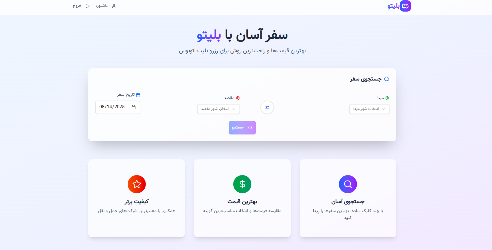
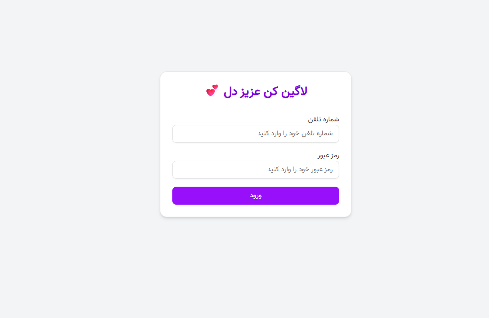
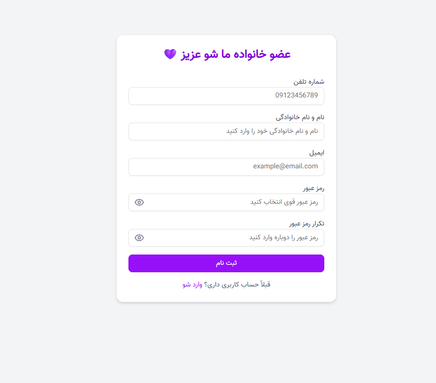
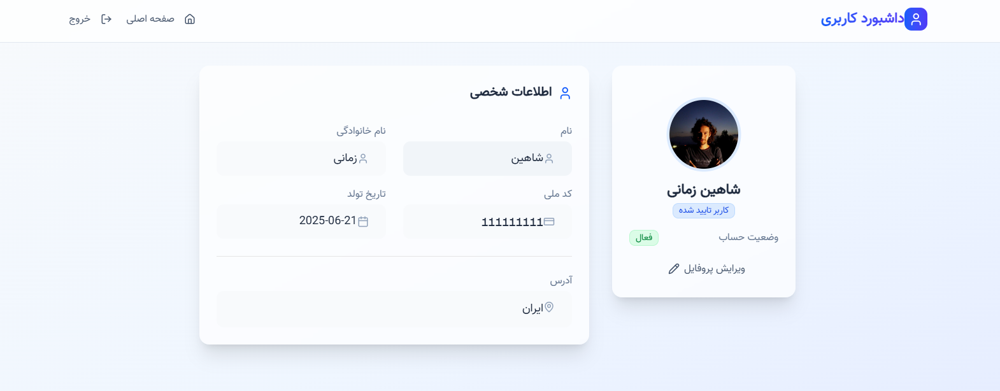
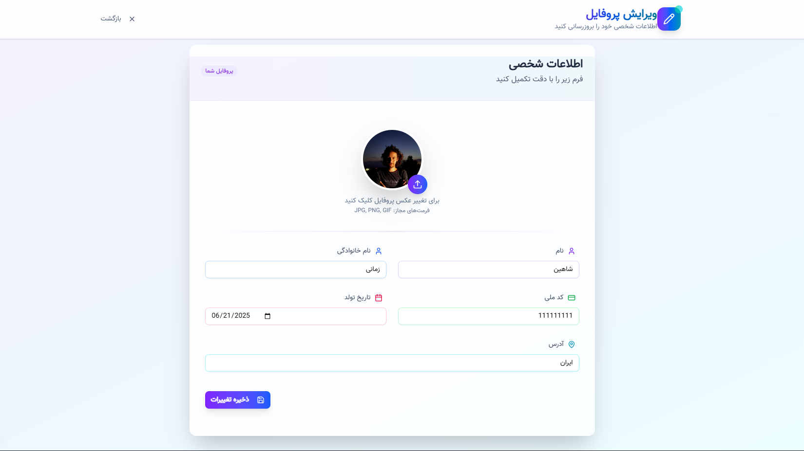
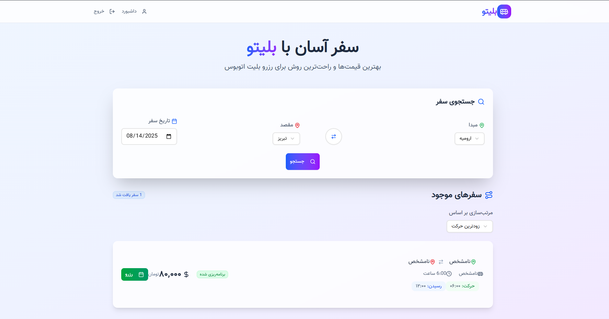
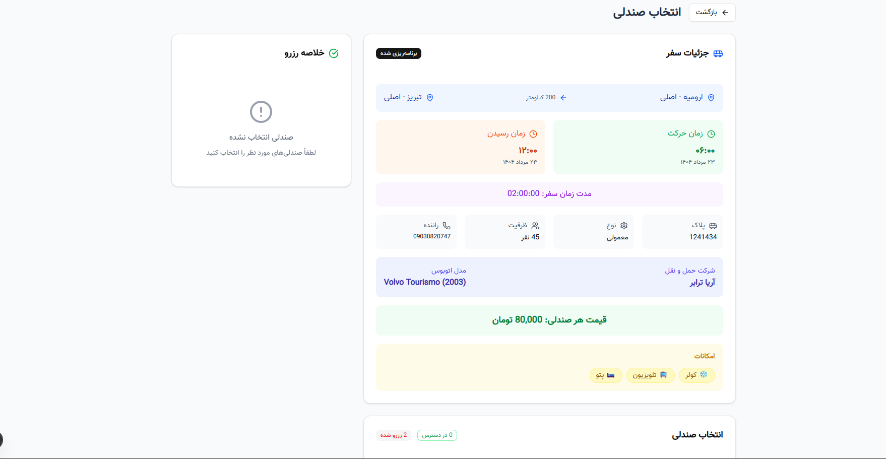

# 🎟️ بلیتو (Blito) — سامانه خرید آنلاین بلیط اتوبوس 🚌

بلیتو یک رابط کاربری مدرن، سریع و بهینه برای جستجو، مشاهده جزئیات سفر و رزرو صندلی‌های اتوبوس است. تمرکز اصلی روی تجربه کاربری روان، رابط مینیمال، و عملکرد بالا با استفاده از Next.js 15 و Tailwind CSS 4 است.  

> این مخزن شامل بخش فرانت‌اند پروژه بلیتو است.

---

## ✨ امکانات کلیدی
- **انتخاب صندلی تعاملی** با حالت‌های «در دسترس»، «انتخاب‌شده» و «رزرو‌شده» ✅❌
- **جزئیات کامل سفر**: مبدا، مقصد، زمان حرکت/رسیدن، پلاک اتوبوس، شرکت مجری ⏰🗺️
- **نمایش ظرفیت**: تعداد کل، رزرو‌شده و در دسترس 🎫
- **محاسبه خودکار قیمت** و خلاصه سفارش پیش از پرداخت 💳
- **ورود/ثبت‌نام و داشبورد** برای مدیریت اطلاعات کاربر 🔐
- **UI مدرن** با کامپوننت‌های قابل‌استفاده‌مجدد و آیکون‌های Lucide 🧩

---

## 🧱 تکنولوژی‌ها و معماری
- **Next.js 15 (App Router)**
- **React 19** + **TypeScript 5**
- **Tailwind CSS 4** + PostCSS
- **Radix UI** و **Shadcn-style Components** (پوشه `components/ui`)
- **Lucide React** برای آیکون‌ها
- **Axios** برای فراخوانی API

> فونت فارسی Vazir/Vazirmatn در `app/layout.tsx` بارگذاری شده است.

---
## 📸 پیش‌نمایش

> برای مشاهده بهتر، روی هر تصویر کلیک کنید تا نسخه کامل باز شود.

| صفحه | پیش‌نمایش |
|------|-----------|
| **صفحه اصلی** |  |
| **صفحه ورود** |  |
| **صفحه ثبت‌نام** |  |
| **صفحه پروفایل کاربر** |  |
| **صفحه ویرایش پروفایل** |  |
| **صفحه نتایج جستجو** |  |
| **صفحه انتخاب صندلی** |  |

---

## 📂 ساختار پوشه‌ها (خلاصه)
```text
blito-frontend/
  app/
    booking/[tripId]/page.tsx   ← صفحه انتخاب صندلی و جزئیات سفر
    dashboard/page.tsx          ← داشبورد کاربر
    dashboard/edit/page.tsx     ← ویرایش پروفایل
    login/page.tsx              ← ورود
    register/page.tsx           ← ثبت‌نام
    page.tsx                    ← صفحه اصلی
    layout.tsx                  ← چیدمان و متادیتا
    globals.css                 ← استایل‌های سراسری
  components/ui/                ← کتابخانه کامپوننت‌های UI
  lib/utils.ts                  ← توابع کمکی
  next.config.ts                ← تنظیمات Next.js
  package.json                  ← اسکریپت‌ها و وابستگی‌ها
  tsconfig.json                 ← تنظیمات TypeScript
  public/                       ← دارایی‌های ثابت
```

---

## 🚀 شروع سریع (لوکال)
### پیش‌نیازها
- Node.js نسخه 18.18+ یا 20+
- npm (یا pnpm/yarn/bun)

### نصب و اجرا
```bash
# نصب وابستگی‌ها
npm install

# اجرای محیط توسعه با Turbopack
npm run dev
# پیش‌فرض: http://localhost:3000

# ساخت نسخه تولید
npm run build

# اجرای نسخه تولید
npm run start
```

### اسکریپت‌ها
- `npm run dev`: اجرای محیط توسعه
- `npm run build`: ساخت پروژه
- `npm run start`: اجرای نسخه تولید
- `npm run lint`: بررسی کد با ESLint

---

## 🔌 اتصال به بک‌اند و API
این فرانت‌اند به سرویس‌های بک‌اند (روی پورت 12000) متصل می‌شود. چند مسیر کلیدی:
- دریافت صندلی‌های سفر: `GET http://localhost:12000/seat/api/v1/api/seats/trip/{tripId}/`
- دریافت جزئیات سفر: `GET http://localhost:12000/trips/api/v1/trips/{tripId}/`
- رزرو صندلی‌ها: `POST /seat/api/v1/api/seats/reserve/` (در صورت عدم استفاده از پروکسی، بهتر است به URL کامل بک‌اند تغییر یابد)

نکات مهم:
- اطمینان حاصل کنید CORS در بک‌اند فعال باشد یا برای مسیرهای `/seat` و `/trips` در فرانت‌اند پروکسی تنظیم کنید.
- در حال حاضر آدرس‌ها در کد به‌صورت ثابت تعریف شده‌اند. برای انعطاف بیشتر، می‌توانید آن‌ها را به متغیرهای محیطی (مثلاً `NEXT_PUBLIC_API_BASE`) منتقل کنید.
- توکن احراز هویت از `localStorage` خوانده می‌شود. قبل از رزرو باید کاربر وارد شده باشد.

نمونه فایل `.env.local` (پیشنهادی):
```env
# نمونه — نیازمند اعمال در کد جهت استفاده
NEXT_PUBLIC_API_BASE=http://localhost:12000
```

---

## 🧭 مسیرهای مهم برنامه
- `app/booking/[tripId]/page.tsx`: انتخاب صندلی، نمایش ظرفیت، قیمت، و رزرو
- `app/login/page.tsx`: ورود کاربر
- `app/register/page.tsx`: ثبت‌نام
- `app/dashboard/page.tsx`: خلاصه حساب کاربری
- `app/dashboard/edit/page.tsx`: ویرایش اطلاعات پروفایل

ویژگی‌های صفحه انتخاب صندلی:
- انتخاب حداکثر ۴ صندلی هم‌زمان
- نمایش نام رزروکننده روی صندلی‌های رزروشده (در صورت موجود بودن داده)
- هایلایت صندلی انتخاب‌شده و جلوگیری از انتخاب صندلی رزروشده
- محاسبه و نمایش مبلغ کل قبل از پرداخت

---

## 🎨 طراحی و تجربه کاربری
- طراحی مینیمال و راست‌به‌چپ‌پسند با Tailwind
- استفاده از Badge، Card، Dialog، Input، Select و سایر کامپوننت‌های `components/ui`
- آیکون‌های Lucide برای خوانایی بهتر

---

## 🤝 مشارکت در توسعه
1. یک شاخه جدید بسازید: `feat/your-feature` یا `fix/your-bug`
2. کد را با استانداردهای موجود بنویسید و `npm run lint` را اجرا کنید
3. Pull Request ارسال کنید ✅

پیشنهادهای شما برای بهبود DX/UX با آغوش باز پذیرفته می‌شود! 🙌

---

## ☁️ استقرار
- بهترین گزینه: استقرار روی Vercel
- متغیرهای محیطی (در صورت استفاده) را در داشبورد سرویس استقرار تنظیم کنید
- فرمان‌ها: `npm run build` سپس `npm run start`

---

## 🔒 مجوز
حق نشر برای تیم «بلیتو» محفوظ است. استفاده در پروژه‌های دیگر تنها با اجازه کتبی مجاز است.

---

## 📞 پشتیبانی
- سوال یا باگ دارید؟ Issue باز کنید یا با تیم توسعه تماس بگیرید.

با عشق ساخته شده برای تجربه بهتر خرید بلیط اتوبوس 💙🚌
